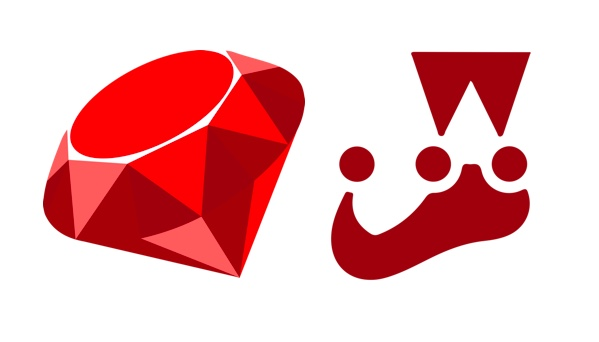

# Jest-Runner-Minitest

[](https://travis-ci.org/pepibumur/jest-runner-minitest)
[](https://codeclimate.com/github/pepibumur/jest-runner-minitest/maintainability)
[](https://codeclimate.com/github/pepibumur/jest-runner-minitest/test_coverage)



A Jest runner that can be used to run your Ruby minitest tests.

## Usage

### Install

Install `jest` and `jest-runner-minitest`:

```
yarn add -D jest jest-runner-minitest
```

With `NMP`:

```
npm install --save-dev jest jest-runner-minitest
```

### Add it to your project

Add the following to your `package.json`:

```json
"jest": {
	"moduleFileExtensions": [
	  "rb"
	],
	"runner": "jest-runner-minitest",
	"testMatch": [
	  "**/?(*_)_test.rb"
	]
},
```

Or to your `jest.config.js`:

```js
module.exports = {
  runner: "jest-runner-minitest",
  moduleFileExtensions: ["rb"],
  testMatch: ["**/?(*_)_test.rb"]
};
```

Then simply run Jest:

```
yarn test
```

## Contribute

1. Git clone the repository `git clone git@github.com:pepibumur/jest-runner-minitest.git`.
2. Install dependencies `yarn install`.
3. Run `yarn dev`. It'll automatically rebuild your changes.

## vscode

If you are using vscode to work on this project, we'd recommend you to install the following extensions:

* [Prettier](https://marketplace.visualstudio.com/items?itemName=esbenp.prettier-vscode)

## References

* [jest-runner-go](https://github.com/MaximeHeckel/jest-runner-go)
* [Jest default runner](https://github.com/facebook/jest/blob/03cce3d8718ad8c548406e35c8aa9b84b209d0e9/packages/jest-runner/src/index.js)
* [Jest runner types](https://github.com/facebook/jest/blob/master/types/TestResult.js)
